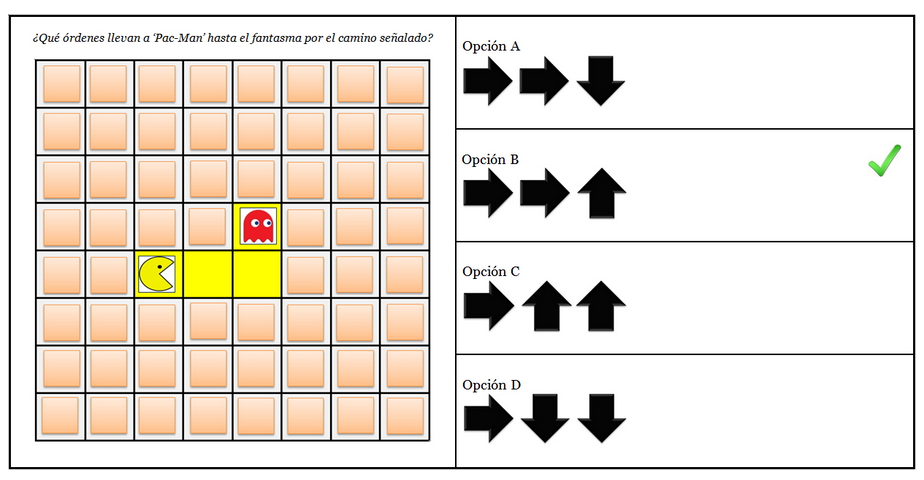

# Test de pensamiento computacional

## Ejemplo
- ¿Qué órdenes llevan a ‘Pac-Man’ hasta el fantasma por el camino señalado?

## Preguntas

- ¿Qué órdenes llevan a ‘Pac-Man’ hasta el fantasma por el camino señalado?
- ¿Qué orden falta en la secuencia para llevar a ‘Pac-Man’ hasta el fantasma por el camino señalado?
- Para llevar a ‘Pac-Man’ hasta el fantasma por el camino señalado, ¿en qué paso de la siguiente secuencia de órdenes hay un error?
- ¿Qué órdenes debe ejecutar el artista para dibujar el cuadrado? Cada uno de los lados del cuadrado mide 100 píxeles
- ¿Qué órdenes llevan a ‘Pac-Man’ hasta el fantasma por el camino señalado?
- ¿Cuántas veces se debe repetir la secuencia para llevar a ‘Pac-Man’ hasta el fantasma por el camino señalado?
- Para que el artista dibuje una vez el siguiente rectángulo (50 píxeles de ancho y 100 píxeles de alto), ¿en qué paso de la siguiente secuencia de órdenes hay un error?
- ¿Qué órdenes llevan a ‘Pac-Man’ hasta el fantasma por el camino señalado?
- ¿Qué órdenes llevan a ‘Pac-Man’ hasta el fantasma por el camino señalado?
- ¿Qué bloque falta en la siguiente secuencia de órdenes para que ‘Pac-Man’ llegue hasta el fantasma por el camino señalado?
- Para que ‘Pac-Man’ llegue hasta el fantasma por el camino señalado, ¿en qué paso de la siguiente secuencia de órdenes hay un error?
- ¿Qué secuencia de órdenes debe ejecutar el artista para dibujar la escalera que llegue hasta la flor? Cada peldaño sube 30 píxeles
- ¿Qué órdenes llevan a ‘Pac-Man’ hasta el fantasma por el camino señalado?
- ¿Qué órdenes llevan a ‘Pac-Man’ hasta el fantasma por el camino señalado?
- ¿Qué falta en la siguiente secuencia de órdenes para llevar a ‘Pac-Man’ hasta el fantasma por el camino señalado?
- Para que ‘Pac-Man’ llegue hasta el fantasma por el camino señalado, ¿en qué paso de la siguiente secuencia de órdenes hay un error?
- ¿Qué órdenes llevan a ‘Pac-Man’ hasta el fantasma por el camino señalado?
- ¿Qué órdenes llevan a ‘Pac-Man’ hasta el fantasma por el camino señalado?
- Para que ‘Pac-Man’ llegue hasta el fantasma por el camino señalado, ¿en qué paso de la siguiente secuencia de órdenes hay un error?
- ¿Qué bloque falta en la siguiente secuencia de órdenes para que ‘Pac-Man’ llegue hasta el fantasma por el camino señalado?
- ¿Qué órdenes llevan a ‘Pac-Man’ por el camino señalado hasta las fresas e indican a ‘Pac-Man' que se coma el número de fresas indicado?
- ¿Qué órdenes van llevando a ‘Pac-Man’ por el camino señalado e indicándole que se coma el número de fresas correspondiente?
- ¿Qué falta en la siguiente secuencia de órdenes para que ‘Pac-Man’ avance por el camino señalado comiendo el número de fresas indicadas?
- ¿Qué bloque falta en la siguiente secuencia de órdenes para que ‘Pac-Man’ avance por el camino señalado comiendo el número de fresas indicadas (número desconocido)?
- ¿Qué secuencia debe ejecutar el artista para dibujar el siguiente diseño? Cada uno de los lados de cada cuadrado mide 100 píxeles
- ¿Qué le falta a la siguiente secuencia para que el artista dibuje el siguiente diseño? Cada uno de los lados de cada triángulo mide 50 píxeles
- ¿Qué órdenes van llevando a ‘Pac-Man’ por el camino señalado e indicándole que se coma el número de fresas correspondiente?
- ¿Qué falta en la siguiente secuencia para llevar a ‘Pac-Man’ por el camino señalado hasta las fresas, comiendo el número de fresas indicado?
- 
